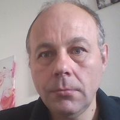

# rsschool-cv

## Petras Venckus (@ptrvenckus)



## Contacts

* Address: Reichenberger Str. 50a, 86161 Augsburg, Germany
* Discord: https://discord.com/channels/@ptrvenckus
* Email: ptrvenckus@gmail.com

## About me

I have studied Catholic Theology. When I was a student I was working as a journalist and translator. I like to learn foreign languages. My hobby is to write poems. I started to learn programming because it is interesting to me and it can help me better to express myself and may be to find some useful work.

## Skills

1. HTML5 basics
2. CSS3 basics
3. JavaScript basics
4. Git basics and GitHub 
5. Visual Studio Code
6. Figma basics
7. Bash (Shell) basics

## Code example

```
function greet() {
  let myName = "Petras";
  return `Hello! I am ${myName}.`;
}
```
## Work experience

I have very little work experience as a programmer. I have colaborated with programmers working in newspaper, but not in technical level. I can make webpage using html and css.

I have two certificates from freeCodeCamp:

* [responsive web design certification](https://www.freecodecamp.org/certification/fcc9a3353ec-7080-47df-93c0-e5a7e8a0ad54/responsive-web-design)
* [legacy javascript algorithms and data structures certification](https://www.freecodecamp.org/certification/fcc9a3353ec-7080-47df-93c0-e5a7e8a0ad54/javascript-algorithms-and-data-structures)

## Education

I have studied Catholic Theology in Vytautas Magnus University, Kaunas, Lithuania.

I have learned about web design in freeCodeCamp and other online courses and tutorials.

## Languages

I can write, speak, read:

* english 
* german
* spanian
* russian
* lithuanian (mother language)


